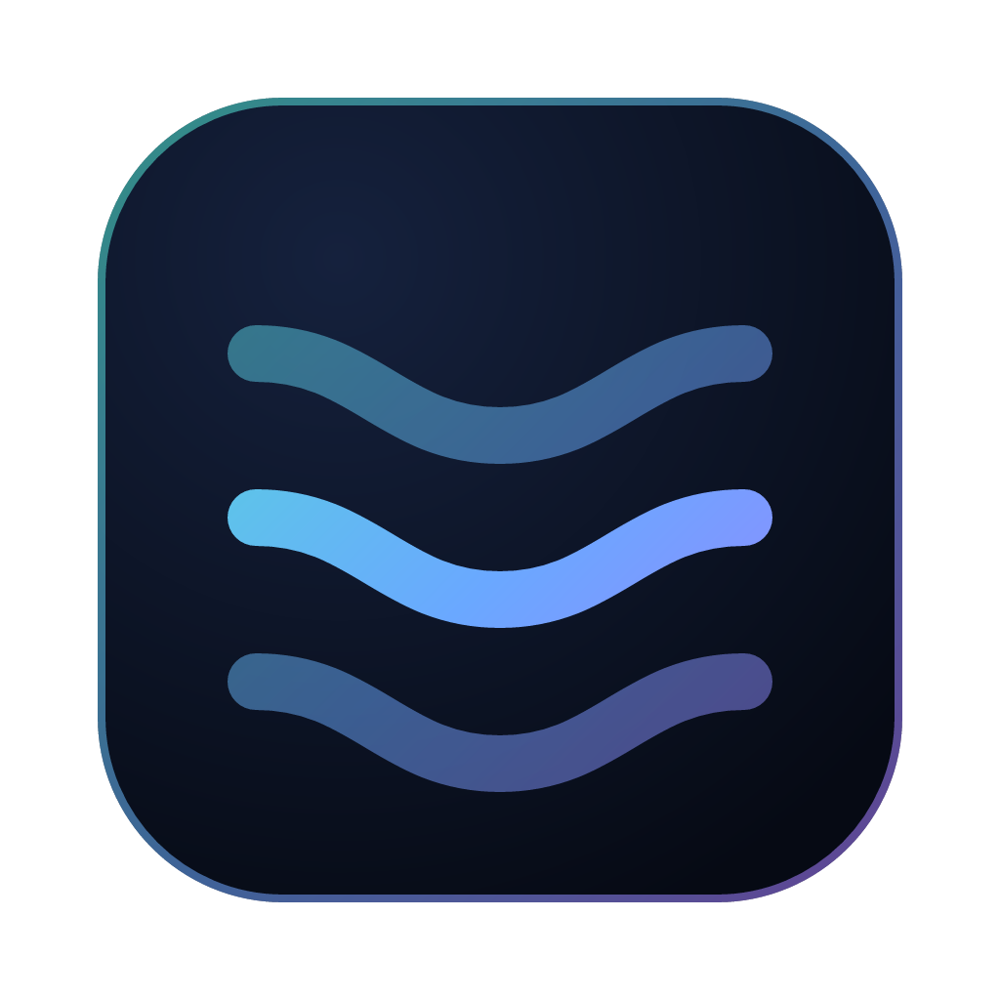

<p align="center">
  
</p>

<h1 align="center">River</h1>

<p align="center">
  A private social communication platform — messages, communities, media, files and calls in one app,<br/>
  end-to-end encrypted, with no phone number, no ads and no tracking.
</p>

<p align="center">
  <a href="https://github.com/martex-dev/river/releases/latest"><b>Download</b></a> ·
  <a href="ROADMAP.md">Roadmap</a> ·
  <a href="STATUS.md">Status</a> ·
  <a href="SECURITY.md">Security</a> ·
  <a href="PRIVACY.md">Privacy</a>
</p>

---

> **River 1.0 — the complete desktop platform (Stage 1).** Windows, macOS and Linux.
> Mobile apps, linked devices and consent-based remote assistance come in Stage 2
> (see the [roadmap](ROADMAP.md)). River has not had an independent security audit yet.

## What works today

- **Direct messages and group chats** — end-to-end encrypted with the Signal protocol
  (libsignal: PQXDH + Double Ratchet). Replies, reactions, edits, deletes, read receipts,
  typing, files, safety numbers and key-change warnings. Groups of up to 32 people.
- **Voice and video calls** — 1:1 calls from any conversation, encrypted media
  (DTLS-SRTP) with setup inside encrypted messages; TURN relay support for strict networks.
- **Communities** — text and voice channels with video and screen sharing, **categories**
  you can rearrange by drag and drop, roles and permissions with a hierarchy, private
  channels, kick/ban, pins, mentions, reactions, typing, presence, unread markers,
  notifications and sounds. All names, profiles and messages are encrypted with the
  community key, which is replaced when someone is removed.
- **Social** — posts and 24-hour stories for all your friends or chosen people,
  comments, reactions, story views and profiles with bios.
- **Files** — every file and picture shared with you, encrypted with its own key and
  decrypted only on your computer.
- **Contacts and calls history**, search in conversations and channels (on your device),
  an encrypted local database, an 18-word recovery phrase with encrypted backups, and
  signed automatic updates.

What River does **not** protect against is listed honestly in
[THREAT_MODEL.md](THREAT_MODEL.md) — for example, the server still sees who messages whom
and when (no sealed sender yet).

## What River is

River brings together things people already know how to use — private chats
and groups, large channels, communities with roles and voice rooms, profiles
with posts and stories, an encrypted file vault, voice and video calls, and
(later) consent-based remote assistance — in one cohesive app with its own design.

Privacy is the foundation, not a feature:

- **End-to-end encrypted** using [libsignal](https://github.com/signalapp/libsignal), the
  library behind Signal. The server relays and stores ciphertext; it never has your keys.
- **No phone number or e-mail required.** Pseudonymous accounts with a cryptographic
  identity you can verify with friends.
- **Local-first.** Search, thumbnails and drafts happen on your device.
- **No ads, no trackers, no analytics.**
- **Open source** (AGPL-3.0). Anyone can audit what runs on their computer.

River is _not_ an anonymity network and does not claim to make anyone
untraceable. See [THREAT_MODEL.md](THREAT_MODEL.md) for exactly what it protects
against and what it does not.

## Install

| System                    | Download                      | Then                                                                           |
| ------------------------- | ----------------------------- | ------------------------------------------------------------------------------ |
| **Windows 10/11**         | `River-Setup-<version>.exe`   | Run it. River installs and opens.                                              |
| **macOS** (Apple silicon) | `River-<version>-arm64.dmg`   | Open, drag River to Applications. First launch: right-click → Open.            |
| **macOS** (Intel)         | `River-<version>-x64.dmg`     | Same as above.                                                                 |
| **Linux**                 | `.AppImage`, `.deb` or `.rpm` | AppImage: make executable and run. deb/rpm: install with your package manager. |

Get the files from the **[latest release](https://github.com/martex-dev/river/releases/latest)**.
Step-by-step instructions, including the one-time security prompts on Windows and
macOS, are in [INSTALL.md](INSTALL.md).

**You only install River once.** It updates itself from GitHub Releases, and every
update is checked against River's Ed25519 release signature before it is installed.
You can choose the Stable, Beta or Nightly channel in Settings → Updates.

## Host a community

Run a River server on your own PC with a free tunnel:
[docs/deployment/host-a-community.md](docs/deployment/host-a-community.md).
Members just install River and paste your invite link.

## Stages

| Stage    | Version           | Platforms             | Scope                                                                                                  |
| -------- | ----------------- | --------------------- | ------------------------------------------------------------------------------------------------------ |
| **1** ✅ | 0.0.1 → **1.0.0** | Windows, macOS, Linux | Encrypted messaging, groups, channels, communities, social profiles/posts/stories, media, files, calls |
| **2**    | 1.0.x → **2.0.0** | + iOS, Android        | Everything in Stage 1 on all platforms, multi-device sync, consent-based remote assistance             |

## For developers

```bash
git clone https://github.com/martex-dev/river.git
cd river
npm ci
npm run dev
```

- [DEVELOPMENT.md](DEVELOPMENT.md) — set-up, scripts, project layout
- [ARCHITECTURE.md](ARCHITECTURE.md) — how River is built and why
- [CRYPTOGRAPHY.md](CRYPTOGRAPHY.md) — keys, protocols and libraries
- [BUILD.md](BUILD.md) — building installers
- [CONTRIBUTING.md](CONTRIBUTING.md) — how to help

## License

River is free software under the [GNU Affero General Public License v3.0](LICENSE).
